## 🎯 DeepSeekMath-V2三重验证机制Mermaid流程图

```mermaid
flowchart TD
    Start([开始]) --> LoadData[加载IMO题目数据]
    LoadData --> CheckRound{是否为第一轮?}
    
    CheckRound -->|是| RawData[使用原始数据]
    CheckRound -->|否| RefineData[使用精炼数据]
    
    RawData --> GenTemplate[应用proof_generation模板]
    RefineData --> GenTemplate
    
    GenTemplate --> GenCmd[构建生成命令]
    GenCmd --> GenExec[执行生成命令]
    
    %% 第一次模型调用 - 证明生成
    GenExec --> ModelGen["🔥模型推理调用#1<br/>AsyncOpenAI.chat.completions.create()"]
    ModelGen --> SaveGen[保存生成结果]
    
    SaveGen --> PrepVerif[准备验证输入]
    PrepVerif --> VerifTemplate[应用proof_verification模板]
    VerifTemplate --> VerifCmd[构建验证命令]
    VerifCmd --> VerifExec[执行验证命令]
    
    %% 第二次模型调用 - 证明验证
    VerifExec --> ModelVerif["🔥模型推理调用#2<br/>AsyncOpenAI.chat.completions.create()"]
    ModelVerif --> SaveVerif[保存验证结果]
    
    SaveVerif --> CheckScore{评分<0.75?}
    CheckScore -->|是| PrepMeta[准备元验证]
    CheckScore -->|否| SkipMeta[跳过元验证]
    
    PrepMeta --> MetaTemplate[应用meta_verification模板]
    MetaTemplate --> MetaCmd[构建元验证命令]
    MetaCmd --> MetaExec[执行元验证命令]
    
    %% 第三次模型调用 - 元验证
    MetaExec --> ModelMeta["🔥模型推理调用#3<br/>AsyncOpenAI.chat.completions.create()"]
    ModelMeta --> SaveMeta[保存元验证结果]
    
    SaveMeta --> UpdatePool[更新证明池]
    SkipMeta --> UpdatePool
    
    UpdatePool --> CheckFinal{达到最大轮次?}
    CheckFinal -->|否| Increment[轮次+1]
    Increment --> PrepVerif
    
    CheckFinal -->|是| FinalResult[输出最终证明]

    %% 样式定义
    classDef modelInfer fill:#EA4335,stroke:#d33b2c,stroke-width:3px,color:#fff
    classDef codeControl fill:#4285F4,stroke:#1a73e8,stroke-width:2px,color:#fff
    classDef dataProcess fill:#34A853,stroke:#137333,stroke-width:2px,color:#fff
    classDef decision fill:#FBBC04,stroke:#f29900,stroke-width:2px,color:#000
    
    class ModelGen,ModelVerif,ModelMeta modelInfer
    class LoadData,GenCmd,GenExec,VerifCmd,VerifExec,MetaCmd,MetaExec,Increment,FinalResult codeControl
    class GenTemplate,RawData,RefineData,SaveGen,PrepVerif,VerifTemplate,SaveVerif,PrepMeta,MetaTemplate,SaveMeta,UpdatePool dataProcess
    class CheckRound,CheckScore,CheckFinal decision
```

---

## 🔥 关键模型推理接口调用环节

### 三次核心模型调用（generate.py:24）
1. **证明生成**: `AsyncOpenAI.chat.completions.create()` - 温度1.0, max_tokens:128K
2. **证明验证**: `AsyncOpenAI.chat.completions.create()` - 温度1.0, max_tokens:64K  
3. **元验证**: `AsyncOpenAI.chat.completions.create()` - 温度1.0, max_tokens:64K

### 🎯 与常规LLM的核心差异

| 对比维度 | 常规LLM推理 | DeepSeekMath-V2 |
|----------|-------------|-----------------|
| **调用次数** | 1次调用 | 3次调用（每轮） |
| **质量控制** | ❌ 无质量筛选 | ✅ 严格评分筛选（<0.75触发元验证） |
| **迭代优化** | ❌ 无迭代 | ✅ 多轮迭代优化（默认16轮） |
| **并行处理** | ❌ 单次处理 | ✅ 32-320进程并行处理 |
| **验证机制** | ❌ 无验证 | ✅ 三重验证体系 |
| **数据格式** | ❌ 简单文本 | ✅ 结构化JSONL格式 |

### 💡 技术架构洞察

**DeepSeekMath-V2的巧妙设计**:
- **统一API**: 三次调用使用相同的底层模型接口
- **模板驱动**: 通过不同的prompt模板实现不同功能
- **代码控制**: 用Python代码严格控制流程和数据流转
- **质量保障**: 通过评分机制确保输出质量

这种"**统一接口 + 模板差异 + 代码控制**"的架构，既保持了系统的简洁性，又实现了复杂的功能，是AI系统设计的典范。